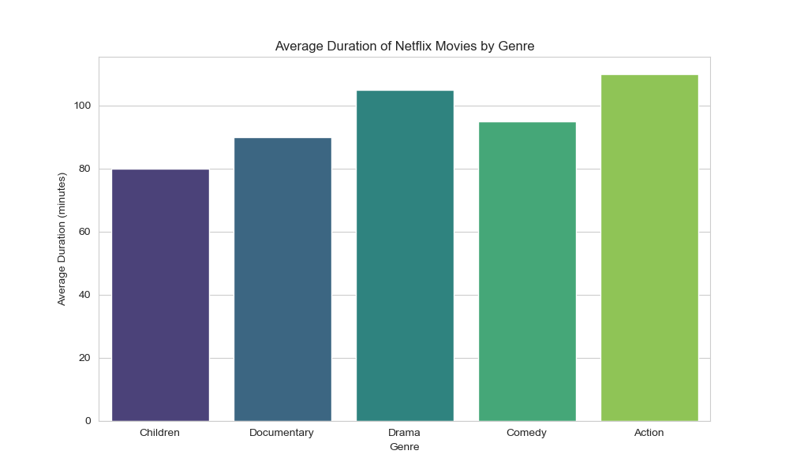
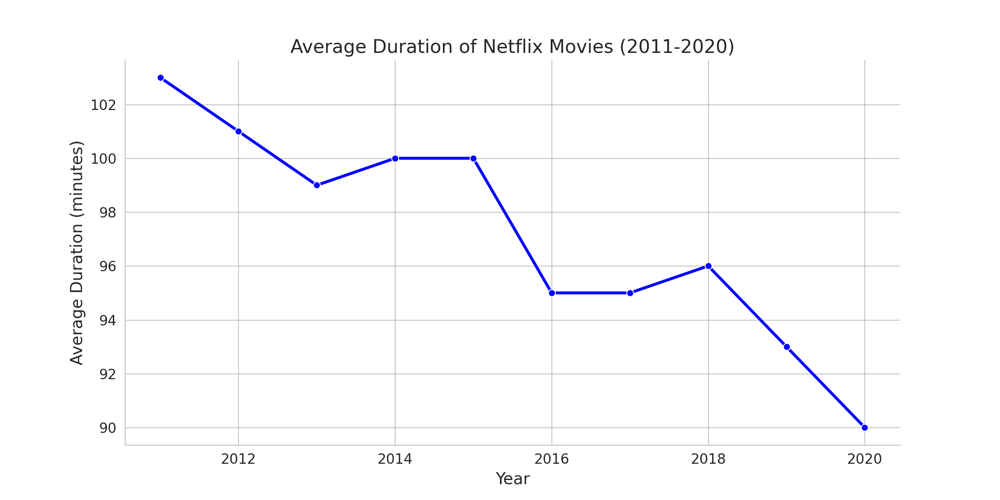
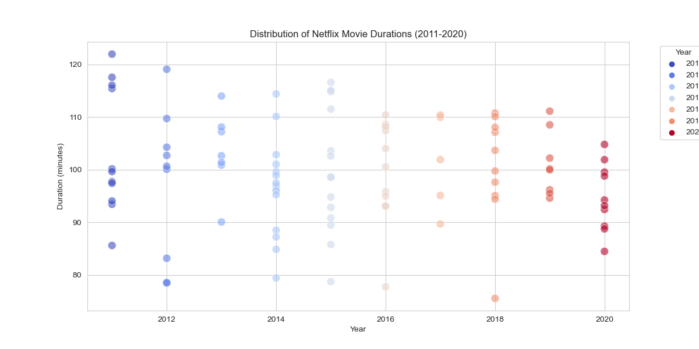

# 🎬 Investigating Netflix Movies


<div align="center">


</div>

## 📌 Project Overview

This project was completed as part of my **Data Engineering training at Saylani Mass IT Training (SMIT)** under the guidance of **Sir Umair Nawaz**.

The objective of this project is to investigate whether Netflix movie durations have changed over time. Using Python data analysis libraries, the project explores Netflix movie data, filters movie records, analyzes yearly duration trends, and visualizes the findings using different plots.

## 🎯 Project Objective

The main goal of this project is to answer the following question:

> Are Netflix movies getting shorter over time?

## 📊 Visualizations

### Movie Durations by Genre



### Netflix Movie Durations Over Time



### Movie Duration Scatter Plot



## 🔍 Key Insights

- The analysis shows a visible change in Netflix movie durations from 2011 to 2020.
- Some visualizations suggest that movie durations have decreased over the years.
- Shorter genres, such as children's movies and documentaries, may have contributed to the decreasing average duration.
- Data visualization helped identify duration trends more clearly than raw tables alone.

## 🛠️ Tools and Technologies

| Tool / Library | Purpose |
|---|---|
| Python | Main programming language |
| Pandas | Data cleaning, filtering, and analysis |
| Matplotlib | Data visualization |
| Seaborn | Enhanced statistical visualizations |
| Jupyter Notebook | Interactive analysis and documentation |

## 📁 Project Structure

```text
Investigating-Netflix-Movies/
│
├── datasets/
│   ├── color_data.csv
│   └── netflix_data.csv
│
├── Investigating Netflix Movies.ipynb
├── Investigating Netflix Movies.pdf
│
├── netflix.jpg
├── netflix_movie_durations_genre_bar_plot.png
├── netflix_movie_durations_clear_plot.png
├── netflix_movie_durations_scatter_plot.png
│
├── README.md
├── LICENSE
└── .gitignore
```

## 📄 Project Components

- **Dataset:** Netflix movie data and supporting color data.
- **Notebook:** Step-by-step analysis in Jupyter Notebook.
- **Visualizations:** Graphs showing movie duration trends and genre patterns.
- **PDF Report:** Exported report version of the notebook analysis.

## 🚀 How to Run This Project

### 1. Clone the repository

```bash
git clone https://github.com/CodeByMan/Investigating-Netflix-Movies.git
```

### 2. Open the project folder

```bash
cd Investigating-Netflix-Movies
```

### 3. Install required libraries

```bash
pip install pandas matplotlib seaborn jupyter
```

### 4. Start Jupyter Notebook

```bash
jupyter notebook
```

### 5. Open the notebook

```text
Investigating Netflix Movies.ipynb
```

## ✅ Final Conclusion

This project demonstrates how Python can be used to explore real-world entertainment data, clean and filter datasets, create meaningful visualizations, and extract useful insights from trends over time.

## 👤 Author

**Muhammad Ali Nawaz**
Data Analyst 

---

## 📄 License

This project is licensed under the [MIT license](LICENSE).

---

<p align="center">
  <b>⭐ If you like this project, consider starring the repository!</b>
</p>


